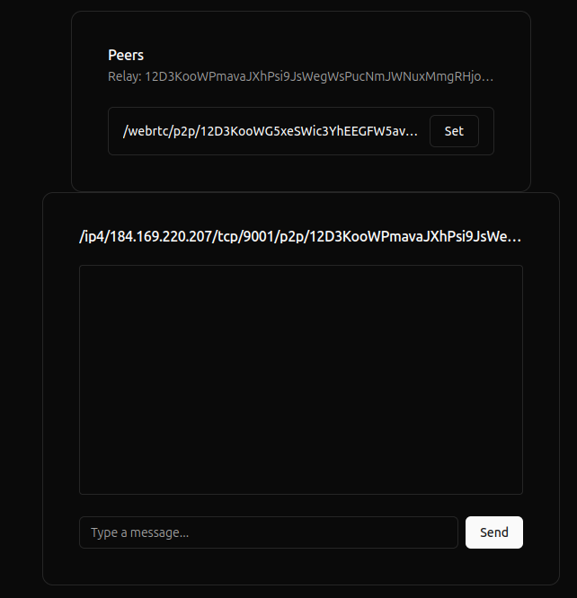
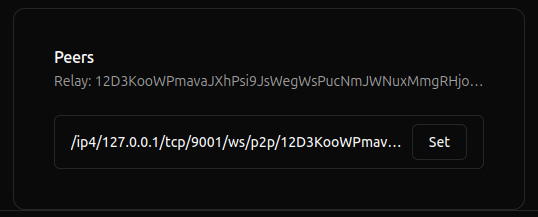
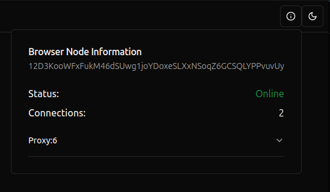

# Liquid Gossip

Because I couldn't think of a better name, this is a fever dream
of @PhearZero.

## Why?

Bandwidth comes at a cost, usually this is a positive correlation
with revenue. More users === more better! Sometimes this is not the case,
there is a common scenario where two parties want to exchange information
without relying on a centralized path (Check out this crypto thing).

We flip the paradigm from the server to the client:

> We put the server on the client - Warren Buffering 2024

### Scenarios

#### Applied Cryptography

Not my specialty but this is a primary use case.
The value added in applied cryptography is the security
of the information. A lot of times access is restricted
and centralized brokers of key information is a non-starter.

By offering a "Pure" p2p system, these primitives can be accessed
over secure channels. Wallets can not only discover the NFTs
in your account but also all of your integrated devices and 
favourite services. For Algorand, think "Pera Discover" meets Zigbee

#### Gamification/Limited Events

No better way to prove you where somewhere or participate in
a realtime activity than in person! Using a gossip discovery layer
could allow for multi-party events where validator nodes
would only connect to local instances.

## Experimenting

Clone this repo

```bash
git clone git@github.com:awesome-algorand/liquid-gossip.git
```

Change to the directory

```bash
cd liquid-gossip
```

Install the dependencies

```bash
npm install
```

Run a service node in a new terminal, 
optionally update the [constants.js](./src/constants.js) `BOOTSTRAP_ADDRESSES` with the `Announced`
to connect from other devices in the local network. 

```bash
PUBLIC_IP=<YOUR_NETOWRK_IP> node server.js
```

Open another terminal and run the frontend

> [!IMPORTANT]  
> The browser is a full node with a unique Key/Pair stored in browser storage
> You must open an incognito tab or use a different browser to connect P2P

```bash
npm run dev
```

A browser should open with the application, open an incognito tab or a different browser.


Wait a minute for discovery and you should see peers in each window:



Click `Set` on the available nodes to change the chat window. 



Use  the `info` buttonto display more information about the proxy and local peer 




That's all for now!

## TODO:

- [] TLS
  - [] Public Hosting
- [] Pure private<->private

